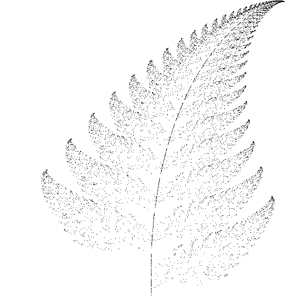

# barnsley
Paproć Barnsleya  
Skrypt rysuje na ekranie o wielkości 600x600 paproć Barnsleya 5 razy, za każdym razem wykonując odpowiednio 1000, 10000, 50000, 100000, 500000 iteracji. Zapisuje również 5 obrazków png po każdej z 5-ciu serii. Wykorzystuje do tych celów bibliotekę pygame.  
UWAGA! Na moim komputerze skrypt wykonuje się ok 9 min!  
  
  
  
  

